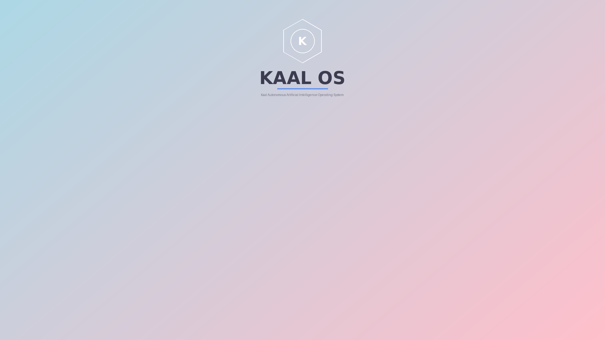

# KAAL OS

**Kaal Autonomous Artificial Intelligence Operating System** — a Fedora 42 based Linux
distribution for gamers, developers, power users, and daily life.



## What makes it KAAL OS

- **Kaal Spaces** — the signature feature. Four built-in runtime profiles
  (Gaming / Development / Power User / Normal) that morph the live system
  without rebooting: CPU governors, GPU power, audio latency, services,
  pinned apps and desktop layout switch on the fly via a D-Bus daemon
  (`kaal-spaced`), a CLI, and a Qt6 switcher. Plus unlimited custom spaces
  with six templates, full create/edit/clone/export/import.
- **Six desktops, one install** — KDE Plasma, GNOME, Hyprland, Sway, XFCE,
  Cinnamon — chosen at install time in the Calamares installer.
- **Fedora Workstation security parity, then some** — SELinux enforcing
  (live and installed), Secure Boot via Fedora's signed shim chain, USBGuard,
  auditd, hardened kernel sysctls, ClamAV on demand, WireGuard/OpenVPN/
  openconnect preinstalled. See [docs/SECURITY.md](docs/SECURITY.md).
- **Package management** — DNF5 + Flatpak + RPM Fusion + Distrobox + AppImage,
  with an update check on every boot.
- **Visual identity** — a light blue → baby pink gradient theme across the
  whole experience: GRUB, Plymouth, SDDM/GDM, wallpapers, icons, cursors.

## Build the ISO — free, no machine needed

This repo builds its own ISO on GitHub Actions (public repos run free):

1. Fork or use this repo
2. **Actions** tab → **Build ISO** → **Run workflow** → `both`
3. ~20 min later the minimal smoke-test ISO appears under the run's
   **Artifacts**; the full ISO follows in 1–2 h

Prefer building locally on a Fedora 42 machine?

```bash
sudo dnf install -y lorax livemedia-creator pykickstart qemu-system-x86-core
cd packages/distro-iso-builder && sudo ./build-iso.sh
```

Full instructions, the 15-minute minimal test, QEMU boot testing and a
troubleshooting table: [BUILD_GUIDE.md](BUILD_GUIDE.md).

## Repository layout

```
packages/
├── distro-bootloader/   GRUB2 + systemd-boot config, GPU detection
├── distro-iso-builder/  kickstarts, 5 profiles, scripts 01-07, build-iso.sh
├── distro-calamares/    profile / DE / space / bootloader selection modules
├── distro-hardware/     scripts 08-16 (firmware → fonts)
├── kaal-spaces/         the Spaces engine: daemon, CLI, GUIs, templates
├── kaal-visual/         GRUB / Plymouth / SDDM / GDM themes, wallpapers, icons
├── kaal-security/       hardening scripts 18-21, antivirus + VPN CLIs
└── distro-ci/           GitHub Actions workflows, QEMU boot test
docs/                    specification, security policy, build pipeline
```

## Status

**Pre-first-build.** All code is written and statically validated
(kickstarts, shell scripts, CI pipeline); the first ISO build is run from
the Actions tab above. This is a one-person project built with agentic
coding — expect iteration.

## Target hardware

NVIDIA RTX 40-series+, AMD GPUs, Intel CPUs 2015+, UEFI (Secure Boot
supported) and legacy BIOS.
